# Importing Necessary Libraries


```python
import warnings
warnings.filterwarnings('ignore')
import subprocess
import pandas as pd
import numpy as np
import matplotlib.pyplot as plt
import seaborn as sns
from scipy.stats import shapiro
from scipy.stats import pearsonr
```


```python
df = pd.read_csv('hepatitis_csv.csv')
df.head()
```

<table border="1" class="dataframe">
  <thead>
    <tr style="text-align: right;">
      <th></th>
      <th>age</th>
      <th>sex</th>
      <th>steroid</th>
      <th>antivirals</th>
      <th>fatigue</th>
      <th>malaise</th>
      <th>anorexia</th>
      <th>liver_big</th>
      <th>liver_firm</th>
      <th>spleen_palpable</th>
      <th>spiders</th>
      <th>ascites</th>
      <th>varices</th>
      <th>bilirubin</th>
      <th>alk_phosphate</th>
      <th>sgot</th>
      <th>albumin</th>
      <th>protime</th>
      <th>histology</th>
      <th>class</th>
    </tr>
  </thead>
  <tbody>
    <tr>
      <th>0</th>
      <td>30</td>
      <td>male</td>
      <td>False</td>
      <td>False</td>
      <td>False</td>
      <td>False</td>
      <td>False</td>
      <td>False</td>
      <td>False</td>
      <td>False</td>
      <td>False</td>
      <td>False</td>
      <td>False</td>
      <td>1.0</td>
      <td>85.0</td>
      <td>18.0</td>
      <td>4.0</td>
      <td>NaN</td>
      <td>False</td>
      <td>live</td>
    </tr>
    <tr>
      <th>1</th>
      <td>50</td>
      <td>female</td>
      <td>False</td>
      <td>False</td>
      <td>True</td>
      <td>False</td>
      <td>False</td>
      <td>False</td>
      <td>False</td>
      <td>False</td>
      <td>False</td>
      <td>False</td>
      <td>False</td>
      <td>0.9</td>
      <td>135.0</td>
      <td>42.0</td>
      <td>3.5</td>
      <td>NaN</td>
      <td>False</td>
      <td>live</td>
    </tr>
    <tr>
      <th>2</th>
      <td>78</td>
      <td>female</td>
      <td>True</td>
      <td>False</td>
      <td>True</td>
      <td>False</td>
      <td>False</td>
      <td>True</td>
      <td>False</td>
      <td>False</td>
      <td>False</td>
      <td>False</td>
      <td>False</td>
      <td>0.7</td>
      <td>96.0</td>
      <td>32.0</td>
      <td>4.0</td>
      <td>NaN</td>
      <td>False</td>
      <td>live</td>
    </tr>
    <tr>
      <th>3</th>
      <td>31</td>
      <td>female</td>
      <td>NaN</td>
      <td>True</td>
      <td>False</td>
      <td>False</td>
      <td>False</td>
      <td>True</td>
      <td>False</td>
      <td>False</td>
      <td>False</td>
      <td>False</td>
      <td>False</td>
      <td>0.7</td>
      <td>46.0</td>
      <td>52.0</td>
      <td>4.0</td>
      <td>80.0</td>
      <td>False</td>
      <td>live</td>
    </tr>
    <tr>
      <th>4</th>
      <td>34</td>
      <td>female</td>
      <td>True</td>
      <td>False</td>
      <td>False</td>
      <td>False</td>
      <td>False</td>
      <td>True</td>
      <td>False</td>
      <td>False</td>
      <td>False</td>
      <td>False</td>
      <td>False</td>
      <td>1.0</td>
      <td>NaN</td>
      <td>200.0</td>
      <td>4.0</td>
      <td>NaN</td>
      <td>False</td>
      <td>live</td>
    </tr>
  </tbody>
</table>
</div>


```python
print(f'Observation : {df.shape[0]}\nFeatures : {df.shape[1]}')
```

    Observation : 155
    Features : 20
    


```python
df.isna().sum()
```


    age                 0
    sex                 0
    steroid             1
    antivirals          0
    fatigue             1
    malaise             1
    anorexia            1
    liver_big          10
    liver_firm         11
    spleen_palpable     5
    spiders             5
    ascites             5
    varices             5
    bilirubin           6
    alk_phosphate      29
    sgot                4
    albumin            16
    protime            67
    histology           0
    class               0
    dtype: int64


### Script for R imputation
<h6 >Note : Installation of r-base and r-essentials in the base working environment is mandatory.


```python
f = open('imputation.R','w+')
f.write('''
library(mice)
df <- read.csv('hepatitis_csv.csv',na.strings=c("na","NA"," ",""))
res <- mice(data=df,m=5,method="pmm",maxiter=5)
complete(res,1) -> result
write.csv(result,"hepatitis_csv_imputation.csv",row.names=FALSE)
''')
f.close()

subprocess.call("rscript imputation.R",shell=True)
print('Successfully imputed missing values in R using Predictive mean matching Techniques')
```

    Successfully imputed missing values in R using Predictive mean matching Techniques
    

### Importing Imputed Data


```python
df = pd.read_csv('hepatitis_csv_imputation.csv')
```


```python
categorical_data=df.select_dtypes(include=["bool","object"])
numerical_data=df.select_dtypes(exclude=["bool","object"])
```


```python
df.info()
```

    <class 'pandas.core.frame.DataFrame'>
    RangeIndex: 155 entries, 0 to 154
    Data columns (total 20 columns):
     #   Column           Non-Null Count  Dtype  
    ---  ------           --------------  -----  
     0   age              155 non-null    int64  
     1   sex              155 non-null    object 
     2   steroid          155 non-null    bool   
     3   antivirals       155 non-null    bool   
     4   fatigue          155 non-null    bool   
     5   malaise          155 non-null    bool   
     6   anorexia         155 non-null    bool   
     7   liver_big        155 non-null    bool   
     8   liver_firm       155 non-null    bool   
     9   spleen_palpable  155 non-null    bool   
     10  spiders          155 non-null    bool   
     11  ascites          155 non-null    bool   
     12  varices          155 non-null    bool   
     13  bilirubin        155 non-null    float64
     14  alk_phosphate    155 non-null    int64  
     15  sgot             155 non-null    int64  
     16  albumin          155 non-null    float64
     17  protime          155 non-null    int64  
     18  histology        155 non-null    bool   
     19  class            155 non-null    object 
    dtypes: bool(12), float64(2), int64(4), object(2)
    memory usage: 11.6+ KB
    

### Sex
 - Out of all patients, its observed that 89.67 % are female and only 10.322 % are male.
 - Its observed that men diagonised with hepatitis tend to survive more when compared with female patients.


```python
df['sex'].value_counts(normalize=True)*100
```


    female    89.677419
    male      10.322581
    Name: sex, dtype: float64


```python
categorical_data.groupby(["sex"])["fatigue"].value_counts(normalize=True)*100
```


    sex     fatigue
    female  True       63.309353
            False      36.690647
    male    True       75.000000
            False      25.000000
    Name: fatigue, dtype: float64


```python
fig,ax = plt.subplots(1,2,figsize=[15,5])
temp = dict(df['sex'].value_counts())
ax[0].pie(temp.values(),labels=temp.keys(),autopct="%.1f%%");
sns.countplot(df['sex'],hue=df['class'],ax = ax[1]);
plt.suptitle('Comparision of Class & Sex',fontsize=25);
```


    
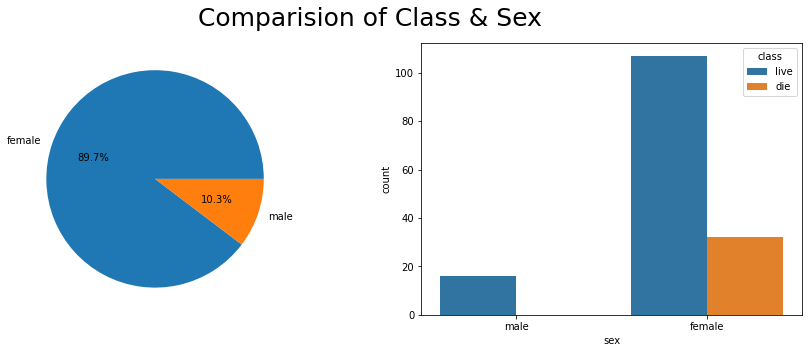
    


### Steroids

- Steroids may damage the liver and cause hepatitis directly.
- For instance, Many athletes use excessively high doses of steroids, which will increase the risk of suffering liver damage.
- Out of all patients, 50.322% consume steroids in one or another form and are prone to hepititis directly or indirectly.
- Its also observed that steroid intake and mortality rate of female is higher than that of male.


```python
df['steroid'].value_counts(normalize=True)*100
```


    True     50.322581
    False    49.677419
    Name: steroid, dtype: float64


```python
categorical_data.groupby(["sex"])["steroid"].value_counts(normalize=True)*100
```


    sex     steroid
    female  True       51.079137
            False      48.920863
    male    False      56.250000
            True       43.750000
    Name: steroid, dtype: float64


```python
fig,ax = plt.subplots(1,3,figsize=[15,5])
temp = dict(df['steroid'].value_counts())
ax[0].pie(temp.values(),labels=temp.keys(),autopct="%.1f%%");
sns.countplot(df['steroid'],hue=df['class'],ax = ax[1]);
sns.countplot(df['steroid'],hue=df['sex'],ax = ax[2]);
ax[0].set_title('Steroid Intake counts')
ax[1].set_title('Steroid Intake Vs class')
ax[2].set_title('Steroid Intake vs Sex')
plt.suptitle('Comparision of Steroid with Class & Sex',fontsize=25)
plt.tight_layout();
```


    
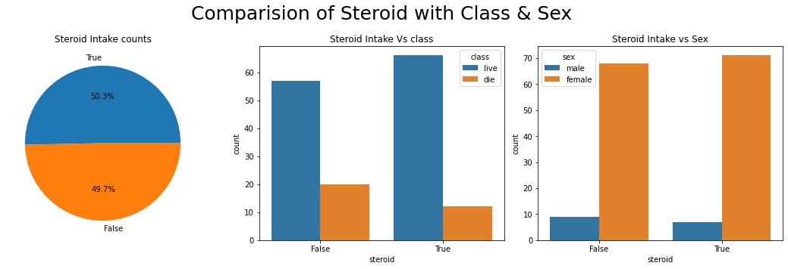
    


### Antivirals
- Its observed that 84.51 % of patients were not on antiviral medications.
- Antiviral medication intake is quite high in females than males.


```python
df['antivirals'].value_counts(normalize=True)*100
```


    False    84.516129
    True     15.483871
    Name: antivirals, dtype: float64


```python
categorical_data.groupby(["sex"])["antivirals"].value_counts(normalize=True)*100
```


    sex     antivirals
    female  False         85.611511
            True          14.388489
    male    False         75.000000
            True          25.000000
    Name: antivirals, dtype: float64


```python
fig,ax = plt.subplots(1,3,figsize=[15,5])
temp = dict(df['antivirals'].value_counts())
ax[0].pie(temp.values(),labels=temp.keys(),autopct="%.1f%%");
sns.countplot(df['antivirals'],hue=df['class'],ax = ax[1]);
sns.countplot(df['antivirals'],hue=df['sex'],ax = ax[2]);
ax[0].set_title('Antivirals Intake counts')
ax[1].set_title('Antivirals Intake Vs class')
ax[2].set_title('Antivirals Intake vs Sex')
plt.suptitle('Comparision of Antivirals with Class & Sex',fontsize=25)
plt.tight_layout();
```


    
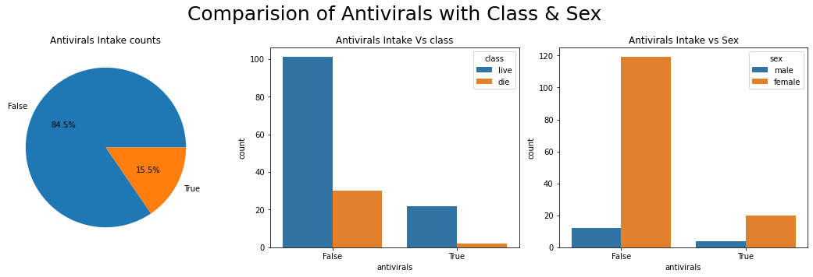
    


### Fatigue
- Its Observed that out of all patients, 64.51 % experience fatigue.
- Based on observation, we conclude female experience more fatigue when compared with male.
- Patients experiencing fatigue are most likely to survive. It may be side-effects due to some medications.


```python
df['fatigue'].value_counts(normalize=True)*100
```


    True     64.516129
    False    35.483871
    Name: fatigue, dtype: float64


```python
categorical_data.groupby(["sex"])["fatigue"].value_counts(normalize=True)*100
```


    sex     fatigue
    female  True       63.309353
            False      36.690647
    male    True       75.000000
            False      25.000000
    Name: fatigue, dtype: float64


```python
fig,ax = plt.subplots(1,3,figsize=[15,5])
temp = dict(df['fatigue'].value_counts())
ax[0].pie(temp.values(),labels=temp.keys(),autopct="%.1f%%");
sns.countplot(df['fatigue'],hue=df['class'],ax = ax[1]);
sns.countplot(df['fatigue'],hue=df['sex'],ax = ax[2]);
ax[0].set_title('Fatigue counts')
ax[1].set_title('Fatigue Vs class')
ax[2].set_title('Fatigue vs Sex')
plt.suptitle('Comparision of Fatigue with Class & Sex',fontsize=25)
plt.tight_layout();
```


    
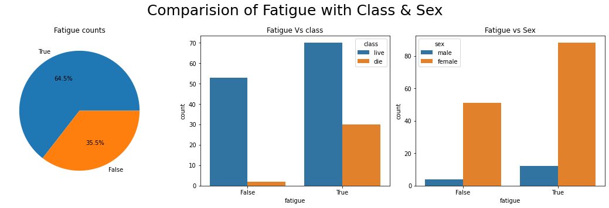
    


### Malaise
- A general sense of being unwell, often accompanied by fatigue, diffuse pain or lack of interest in activities.
- Its observed that 60.64 % of patients experience malaise.
- Fatigue may cause Malaise, but vice versa is not always True.
- Since female experience more fatigue, they are most likely to become malaise than male.


```python
df['malaise'].value_counts(normalize=True)*100
```


    False    60.645161
    True     39.354839
    Name: malaise, dtype: float64


```python
categorical_data.groupby(["sex"])["malaise"].value_counts(normalize=True)*100
```


    sex     malaise
    female  False      61.151079
            True       38.848921
    male    False      56.250000
            True       43.750000
    Name: malaise, dtype: float64


```python
fig,ax = plt.subplots(1,3,figsize=[15,5])
temp = dict(df['malaise'].value_counts())
ax[0].pie(temp.values(),labels=temp.keys(),autopct="%.1f%%");
sns.countplot(df['malaise'],hue=df['class'],ax = ax[1]);
sns.countplot(df['malaise'],hue=df['sex'],ax = ax[2]);
ax[0].set_title('Malaise counts')
ax[1].set_title('Malaise Vs class')
ax[2].set_title('Malaise vs Sex')
plt.suptitle('Comparision of Malaise with Class & Sex',fontsize=25)
plt.tight_layout();
```


    
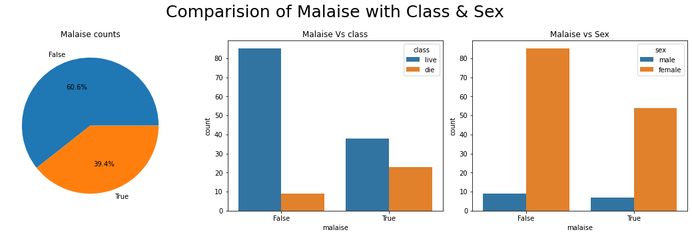
    


### Anorexia
- Anorexia is characterised by a distorted body image, with an unwarranted fear of being overweight.
- Symptoms include trying to maintain a below-normal weight through starvation or too much exercise.
- Its eating disorder causing people to obsess about weight and what they eat.
- Based on observation, we conclude that anorexia is more seen in female which causes increased mortality rate amoung female when compared with males.


```python
df['anorexia'].value_counts(normalize=True)*100
```


    False    79.354839
    True     20.645161
    Name: anorexia, dtype: float64


```python
categorical_data.groupby(["sex"])["anorexia"].value_counts(normalize=True)*100
```


    sex     anorexia
    female  False       79.136691
            True        20.863309
    male    False       81.250000
            True        18.750000
    Name: anorexia, dtype: float64


```python
fig,ax = plt.subplots(1,3,figsize=[15,5])
temp = dict(df['anorexia'].value_counts())
ax[0].pie(temp.values(),labels=temp.keys(),autopct="%.1f%%");
sns.countplot(df['anorexia'],hue=df['class'],ax = ax[1]);
sns.countplot(df['anorexia'],hue=df['sex'],ax = ax[2]);
ax[0].set_title('Anorexia counts')
ax[1].set_title('Anorexia Vs class')
ax[2].set_title('Anorexia vs Sex')
plt.suptitle('Comparision of Anorexia with Class & Sex',fontsize=25)
plt.tight_layout();
```


    
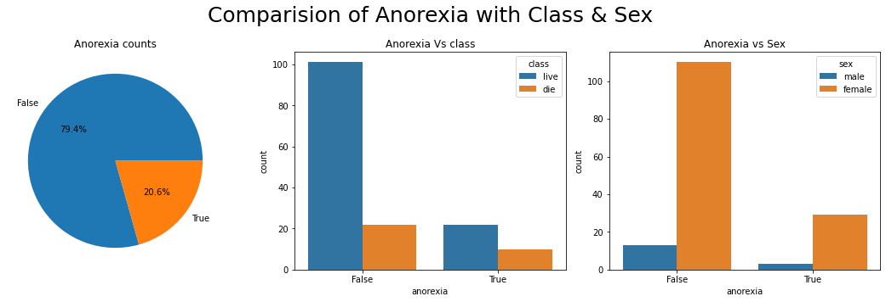
    


### liver_big
- An enlarged liver can have many possible causes. An enlarged liver is one that's bigger than normal. The medical term is hepatomegaly. Rather than a disease, an enlarged liver is a sign of an underlying problem, such as liver disease, congestive heart failure or cancer.
- Out of all patients diagonised with hepatitis, 83.22 % of patients show enlarged liver size. 


```python
df['liver_big'].value_counts(normalize=True)*100
```


    True     83.225806
    False    16.774194
    Name: liver_big, dtype: float64


```python
categorical_data.groupby(["sex"])["liver_big"].value_counts(normalize=True)*100
```


    sex     liver_big
    female  True         84.172662
            False        15.827338
    male    True         75.000000
            False        25.000000
    Name: liver_big, dtype: float64


```python
fig,ax = plt.subplots(1,3,figsize=[15,5])
temp = dict(df['liver_big'].value_counts())
ax[0].pie(temp.values(),labels=temp.keys(),autopct="%.1f%%");
sns.countplot(df['liver_big'],hue=df['class'],ax = ax[1]);
sns.countplot(df['liver_big'],hue=df['sex'],ax = ax[2]);
ax[0].set_title('liver big counts')
ax[1].set_title('liver big Vs class')
ax[2].set_title('liver big vs Sex')
plt.suptitle('Comparision of Liver big with Class & Sex',fontsize=25)
plt.tight_layout();
```


    
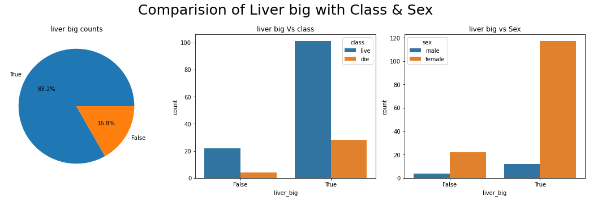
    


### liver_firm
- Out of all patients diagonised with hepatitis, 59.35 % of patients show enlarged liver size along with unsual structure. 


```python
df['liver_firm'].value_counts(normalize=True)*100
```


    False    59.354839
    True     40.645161
    Name: liver_firm, dtype: float64


```python
categorical_data.groupby(["sex"])["liver_firm"].value_counts(normalize=True)*100
```


    sex     liver_firm
    female  False         60.431655
            True          39.568345
    male    False         50.000000
            True          50.000000
    Name: liver_firm, dtype: float64


```python
fig,ax = plt.subplots(1,3,figsize=[15,5])
temp = dict(df['liver_firm'].value_counts())
ax[0].pie(temp.values(),labels=temp.keys(),autopct="%.1f%%");
sns.countplot(df['liver_firm'],hue=df['class'],ax = ax[1]);
sns.countplot(df['liver_firm'],hue=df['sex'],ax = ax[2]);
ax[0].set_title('liver firm counts')
ax[1].set_title('liver firm Vs class')
ax[2].set_title('liver firm vs Sex')
plt.suptitle('Comparision of Liver firm with Class & Sex',fontsize=25)
plt.tight_layout();
```


    
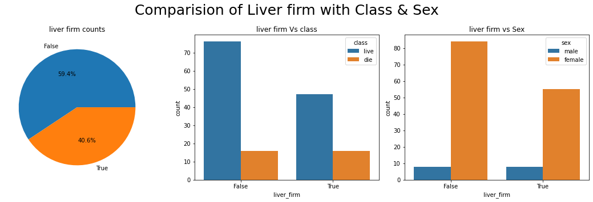
    


### spleen_palpable
- The normal adult spleen lies immediately under the diaphragm in the left upper quadrant of the abdomen. It ranges in length from 6 to 13 cm and in weight from 75 to 120 g. The spleen is not normally palpable except in slender young adults.
- An enlarged spleen shows :
> - feeling full very quickly after eating (an enlarged spleen can press on the stomach)
> - feeling discomfort or pain behind left ribs.
> - anaemia and fatigue.
> - frequent infections.
> - easy bleeding.
- Based on observation, we conclude that 80 % of patients are free from spleen issues.


```python
df['spleen_palpable'].value_counts(normalize=True)*100
```


    False    80.0
    True     20.0
    Name: spleen_palpable, dtype: float64


```python
categorical_data.groupby(["sex"])["spleen_palpable"].value_counts(normalize=True)*100
```


    sex     spleen_palpable
    female  False              81.294964
            True               18.705036
    male    False              68.750000
            True               31.250000
    Name: spleen_palpable, dtype: float64


```python
fig,ax = plt.subplots(1,3,figsize=[15,5])
temp = dict(df['spleen_palpable'].value_counts())
ax[0].pie(temp.values(),labels=temp.keys(),autopct="%.1f%%");
sns.countplot(df['spleen_palpable'],hue=df['class'],ax = ax[1]);
sns.countplot(df['spleen_palpable'],hue=df['sex'],ax = ax[2]);
ax[0].set_title('spleen palpable counts')
ax[1].set_title('spleen palpable Vs class')
ax[2].set_title('spleen palpable vs Sex')
plt.suptitle('Comparision of Spleen palpable with Class & Sex',fontsize=25)
plt.tight_layout();
```


    
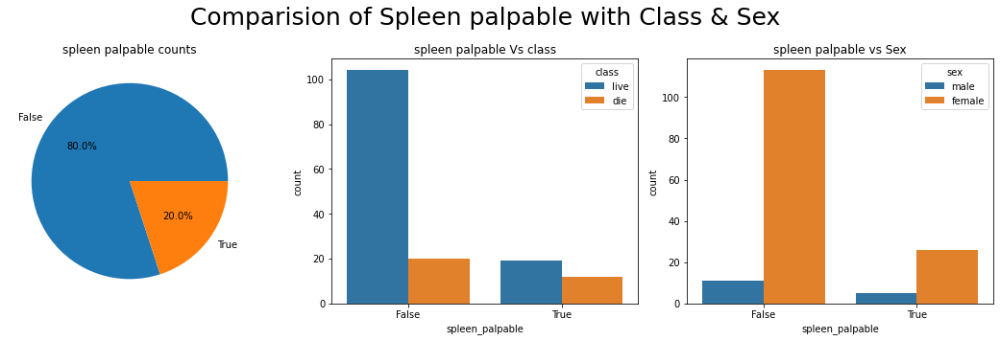
    


### spiders


```python
df['spiders'].value_counts()
```


    False    103
    True      52
    Name: spiders, dtype: int64


```python
categorical_data.groupby(["sex"])["spiders"].value_counts(normalize=True)*100
```


    sex     spiders
    female  False      66.906475
            True       33.093525
    male    False      62.500000
            True       37.500000
    Name: spiders, dtype: float64


```python
fig,ax = plt.subplots(1,3,figsize=[15,5])
temp = dict(df['spiders'].value_counts())
ax[0].pie(temp.values(),labels=temp.keys(),autopct="%.1f%%");
sns.countplot(df['spiders'],hue=df['class'],ax = ax[1]);
sns.countplot(df['spiders'],hue=df['sex'],ax = ax[2]);
ax[0].set_title('spiders counts')
ax[1].set_title('spiders Vs class')
ax[2].set_title('spiders vs Sex')
plt.suptitle('Comparision of Spiders with Class & Sex',fontsize=25)
plt.tight_layout();
```


    
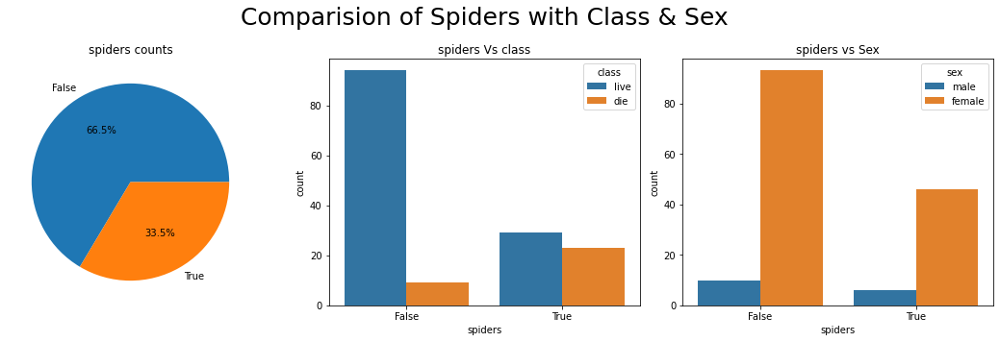
    


### ascites
- Fluid that accumulates in the abdomen might become infected and require treatment with antibiotics.
- Out of all patients, 12.90 % of female patient experience ascites.


```python
df['ascites'].value_counts(normalize=True)*100
```


    False    87.096774
    True     12.903226
    Name: ascites, dtype: float64


```python
categorical_data.groupby(["sex"])["ascites"].value_counts(normalize=True)*100
```


    sex     ascites
    female  False       85.611511
            True        14.388489
    male    False      100.000000
    Name: ascites, dtype: float64


```python
fig,ax = plt.subplots(1,3,figsize=[15,5])
temp = dict(df['ascites'].value_counts())
ax[0].pie(temp.values(),labels=temp.keys(),autopct="%.1f%%");
sns.countplot(df['ascites'],hue=df['class'],ax = ax[1]);
sns.countplot(df['ascites'],hue=df['sex'],ax = ax[2]);
ax[0].set_title('ascites counts')
ax[1].set_title('ascites Vs class')
ax[2].set_title('ascites vs Sex')
plt.suptitle('Comparision of Ascites with Class & Sex',fontsize=25)
plt.tight_layout();
```


    
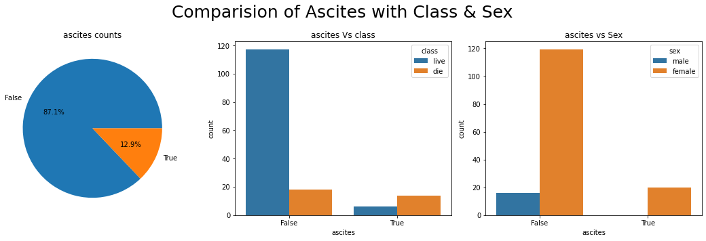
    


### varices
- It is an abnormally dilated vessel with a tortuous course. Varices usually occur in the venous system, but may also occur in arterial or lymphatic vessels.
- varices is mostly seen in female patients covering over 11.6129 % 


```python
df['varices'].value_counts(normalize=True)*100
```


    False    88.387097
    True     11.612903
    Name: varices, dtype: float64


```python
categorical_data.groupby(["sex"])["varices"].value_counts(normalize=True)*100
```


    sex     varices
    female  False      87.769784
            True       12.230216
    male    False      93.750000
            True        6.250000
    Name: varices, dtype: float64


```python
fig,ax = plt.subplots(1,3,figsize=[15,5])
temp = dict(df['varices'].value_counts())
ax[0].pie(temp.values(),labels=temp.keys(),autopct="%.1f%%");
sns.countplot(df['varices'],hue=df['class'],ax = ax[1]);
sns.countplot(df['varices'],hue=df['sex'],ax = ax[2]);
ax[0].set_title('varices counts')
ax[1].set_title('varices Vs class')
ax[2].set_title('varices vs Sex')
plt.suptitle('Comparision of Varices with Class & Sex\n',fontsize=25)
plt.tight_layout();
```


    
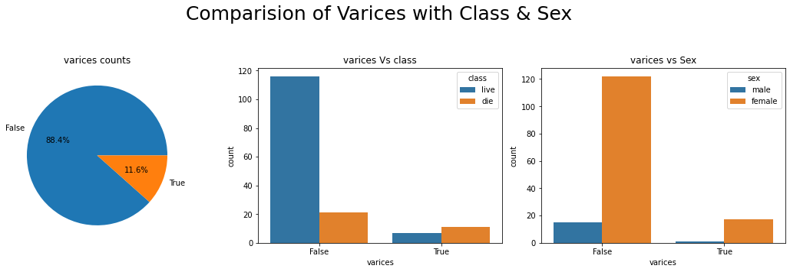
    


### Histology
- Histology is used to diagnose diseases in humans, animals, and plants and to analyze the effects of treatment. Histology is used during autopsies and forensic investigations to help understand unexplained deaths.


```python
df['histology'].value_counts(normalize=True)*100
```


    False    54.83871
    True     45.16129
    Name: histology, dtype: float64


```python
categorical_data.groupby(["sex"])["histology"].value_counts(normalize=True)*100
```


    sex     histology
    female  False        52.517986
            True         47.482014
    male    False        75.000000
            True         25.000000
    Name: histology, dtype: float64


```python
fig,ax = plt.subplots(1,3,figsize=[15,5])
temp = dict(df['histology'].value_counts())
ax[0].pie(temp.values(),labels=temp.keys(),autopct="%.1f%%");
sns.countplot(df['histology'],hue=df['class'],ax = ax[1]);
sns.countplot(df['histology'],hue=df['sex'],ax = ax[2]);
ax[0].set_title('Histology counts')
ax[1].set_title('histology Vs class')
ax[2].set_title('histology vs Sex')
plt.suptitle('Comparision of Histology with Class & Sex',fontsize=25)
plt.tight_layout();
```


    
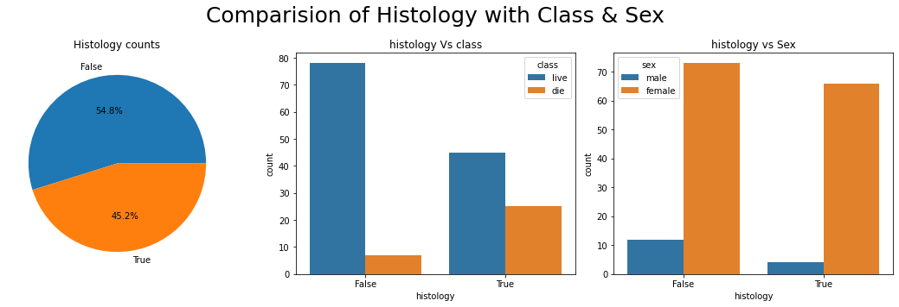
    


### Class


```python
df['class'].value_counts(normalize=True)*100
```


    live    79.354839
    die     20.645161
    Name: class, dtype: float64


```python
temp = dict(df['class'].value_counts())
plt.pie(temp.values(),labels=temp.keys(),autopct="%.1f%%");
plt.suptitle('Distribution of class',fontsize=25);
```


    
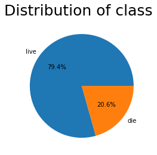
    


```python
categorical_data.groupby(["sex"])["class"].value_counts(normalize=True)*100
```


    sex     class
    female  live      76.978417
            die       23.021583
    male    live     100.000000
    Name: class, dtype: float64


### Protime
The average time range for blood to clot is about 10.0 to 12.5 seconds. A number higher than that range means it takes blood longer than usual to clot. A number lower than that range means blood clots more quickly than normal.


```python
dict(df['protime'].agg(['mean','median','std','var','kurt']))
```


    {'mean': 60.30967741935484,
     'median': 60.0,
     'std': 24.86314952777947,
     'var': 618.1762044407204,
     'kurt': -0.4163287228986259}


```python
sns.displot(df['protime'],kde=True);
statistic,pvalue = shapiro(df['protime'])
temp = f'''Statistical Normality Test for Protime\n
H0 : Protime follows normal distribution
H1 : Protime is not normally distributed
pvalue    : {round(pvalue,4)} < 0.05\n
Conclusion :\n      Rejecting Null Hypothesis as pvalue
      is less than 0.05 at 5% level of Significance.
      Thus, Protime is not normally distributed.'''
plt.text(120,5,temp,fontsize=20,color='green');
plt.title('Distribution of Protime\n',fontsize=25);
```


    
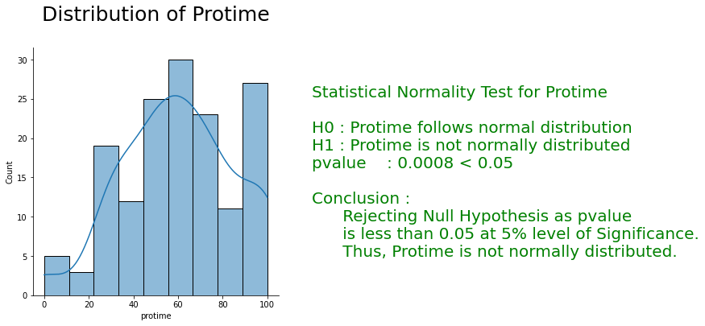
    


```python
sns.jointplot(x="age", y="protime", data=df,kind='hex');
temp = '''
NOTE : 

    - Based on Visualization, we conclude that
      patients between age 20-60 have high Prothrombin Time / Protime
    
    - The average time range for blood to clot is about 10.0 to 12.5 seconds.
      Higher range means it takes blood longer than usual to clot.
      Lower than that range means blood clots more quickly than normal.
'''
plt.text(105,20,temp,fontsize=15,color='green');
plt.text(105,85,'Age Vs Protime',fontsize=25);
```


    
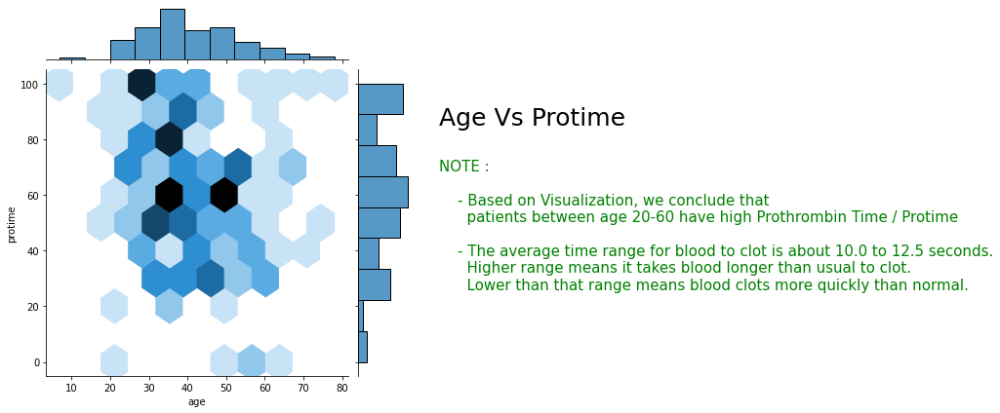
    


### Age


```python
dict(df['age'].agg(['mean','median','std','var','kurt']))
```


    {'mean': 41.2,
     'median': 39.0,
     'std': 12.565878349773195,
     'var': 157.9012987012987,
     'kurt': -0.10627063006847859}


```python
sns.displot(df['age'],kde=True);
statistic,pvalue = shapiro(df['age'])
temp = f'''Statistical Normality Test for Age

H0 : Age follows normal distribution
H1 : Age is not normally distributed\n
pvalue    : {round(pvalue,4)} > 0.05\n
Conclusion : \n      Accepting Null Hypothesis as pvalue is
      greater than 0.05 at 5% level of Significance.
      Thus, Age is normally distributed.'''
plt.text(100,5,temp,fontsize=20,color='green');
plt.title('Distribution of Age\n',fontsize=25);
```


    
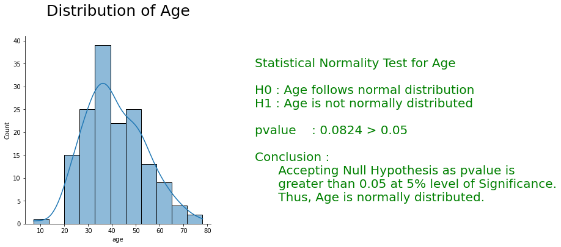
    


### Bilirubin
 - bilirubin has been shown to possess important functions as an antioxidant, but it also serves simply as a means to excrete unwanted heme, derived from various heme-containing proteins such as hemoglobin, myoglobin, and various P450 enzymes.
 - Elevated levels may indicate liver damage or disease. Higher than normal levels of direct bilirubin in your blood may indicate your liver isn't clearing bilirubin properly. Elevated levels of indirect bilirubin may indicate other problems.
 - Hepatitis happens when your liver gets inflamed, often due to a viral infection. When it's inflamed, your liver can't easily process bilirubin, leading to a buildup of it in your blood.


```python
dict(df['bilirubin'].agg(['mean','median','std','var','kurt']))
```


    {'mean': 1.428387096774193,
     'median': 1.0,
     'std': 1.1959213607637946,
     'var': 1.4302279011311263,
     'kurt': 10.412826496562545}


```python
sns.displot(df['bilirubin'],kde=True);
statistic,pvalue = shapiro(df['bilirubin'])
temp = f'''Statistical Normality Test for Bilirubin\n
H0 : Bilirubin follows normal distribution
H1 : Bilirubin is not normally distributed\n
pvalue    : {round(pvalue,4)} < 0.05\n
Conclusion : \n      Rejecting Null Hypothesis as pvalue
      is less than 0.05 at 5% level of Significance.
      Thus, Bilirubin is not normally distributed.'''
plt.text(10,5,temp,fontsize=20,color='green');
plt.title('Distribution of Bilirubin\n',fontsize=25);
```


    
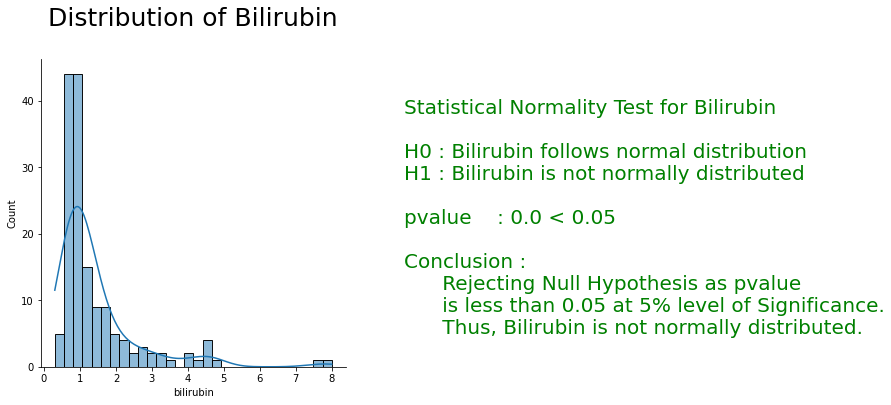
    


```python
sns.jointplot(x="age", y="bilirubin", data=df,kind='hex');
temp = '''
NOTE : 

    - Based on Visualization, we conclude that
      patients between age 30-60 have higher level of bilirubin
      in their bloodstream.
    
    - High bilirubin levels can cause jaundice. 
    
    - Jaundice makes the skin and the whites of the eyes appear yellow,
      due to the brown and yellow bilirubin in the blood.
'''
plt.text(100,1,temp,fontsize=15,color='green');
plt.text(100,7.5,'Age Vs Bilirubin',fontsize=25);
```


    
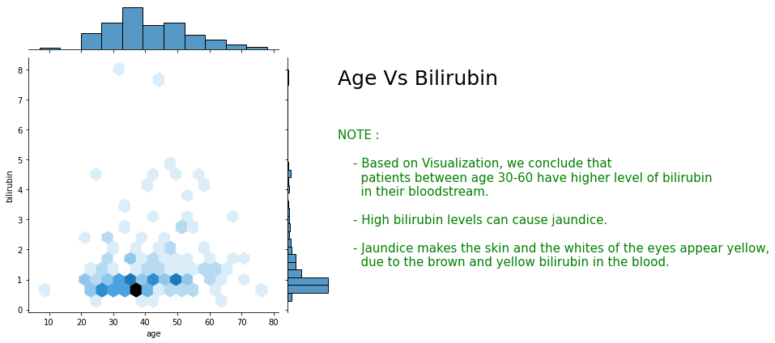
    


### Albumin
 - Albumin is a protein made by your liver. Albumin helps keep fluid in your bloodstream so it doesn't leak into other tissues. It is also carries various substances throughout your body, including hormones, vitamins, and enzymes. Low albumin levels can indicate a problem with your liver or kidneys.
 - Synthesis of albumin takes place in the liver, after which it is excreted into the bloodstream. Albumin can be found in the bloodstream, interstitial space, as well as other fluids. When found in other fluids in large concentrations, such as in ascites or urine, it is often an indication of underlying pathology.


```python
dict(df['albumin'].agg(['mean','median','std','var','kurt']))
```


    {'mean': 3.793548387096774,
     'median': 4.0,
     'std': 0.6478413124755005,
     'var': 0.4196983661499791,
     'kurt': 1.0816753518842082}


```python
sns.displot(df['albumin'],kde=True);
statistic,pvalue = shapiro(df['albumin'])
temp = f'''Statistical Normality Test for Albumin\n
H0 : Albumin follows normal distribution
H1 : Albumin is not normally distributed\n
pvalue    : {round(pvalue,4)} < 0.05\n
Conclusion :\n      Rejecting Null Hypothesis as pvalue 
      is less than 0.05 at 5% level of Significance.
      Thus, Albumin is not normally distributed.'''
plt.text(7,8,temp,fontsize=20,color='green');
plt.title('Distribution of Albumin\n',fontsize=25);
```


    
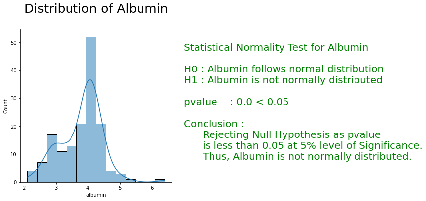
    


```python
sns.jointplot(x="age", y="albumin", data=df,kind='hex');
temp = '''
NOTE : 

    - Based on Visualization, we conclude that
      patients between age 20-60 have higher level of albumin
      in their bloodstream.
    
    - A normal albumin range is 3.4 to 5.4 g/dL.
      If you have a lower albumin level, you may have malnutrition.
      It can also mean that you have liver disease or an inflammatory disease.
      Higher albumin levels may be caused by acute infections,
      burns, and stress from surgery or a heart attack. 
    
    - Albumin transports various substances, including bilirubin, 
      fatty acids, metals, ions, hormones, and exogenous drugs.
'''
plt.text(100,1.8,temp,fontsize=15,color='green');
plt.text(100,6,'Age Vs Albumin',fontsize=25);
```


    
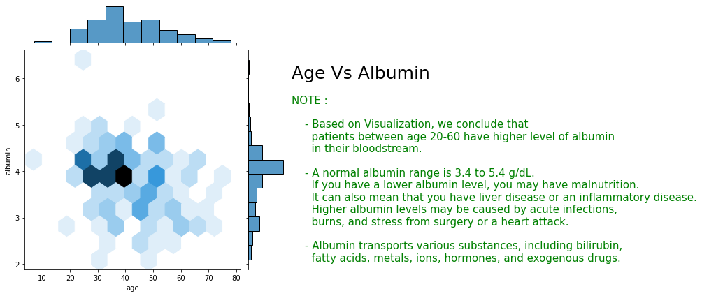
    


### alk_phosphate
 - The ALP level in healthy adults should be 20–140 units per liter (U/L). Children tend to have significantly higher levels of ALP than adults because their bones are still growing. A person recovering from a bone injury may also have a raised ALP level in the 3 months after the injury while their bone heals.
 - High ALP usually means that either the liver has been damaged or a condition causing increased bone cell activity is present. If other liver tests such as bilirubin, aspartate aminotransferase (AST), or alanine aminotransferase (ALT) are also high, usually the increased ALP is caused by liver damage or disease.


```python
dict(df['alk_phosphate'].agg(['mean','median','std','var','kurt']))
```


    {'mean': 104.47096774193548,
     'median': 85.0,
     'std': 50.99074396237631,
     'var': 2600.055969836616,
     'kurt': 1.8995664696878145}


```python
sns.displot(df['alk_phosphate'],kde=True);
statistic,pvalue = shapiro(df['alk_phosphate'])
temp = f'''Statistical Normality Test for alk_phosphate\n
H0 : Alk_phosphate follows normal distribution
H1 : Alk_phosphate is not normally distributed\n
pvalue    : {round(pvalue,4)} < 0.05\n
Conclusion :\n      Rejecting Null Hypothesis as pvalue
      is less than 0.05 at 5% level of Significance.
      Thus, Alk_phosphate is not normally distributed.'''
plt.text(340,10,temp,fontsize=20,color='green');
plt.title('Distribution of alk_phosphate\n',fontsize=25);
```


    
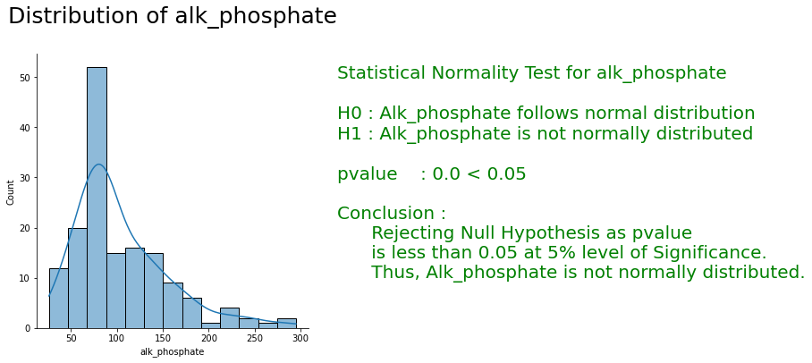
    


```python
sns.jointplot(x="age", y="alk_phosphate", data=df,kind='hex');
temp = '''
NOTE : 

    - Based on Visualization, we conclude that
      patients between age 20-60 have moderate level of alk_phosphate
      in their bloodstream.
    
    - High alkaline phosphatase levels may mean there is damage to your
      liver or that you have a type of bone disorder.
'''
plt.text(100,60,temp,fontsize=15,color='green');
plt.text(100,250,'Age Vs Alk_phosphate',fontsize=25);
```


    
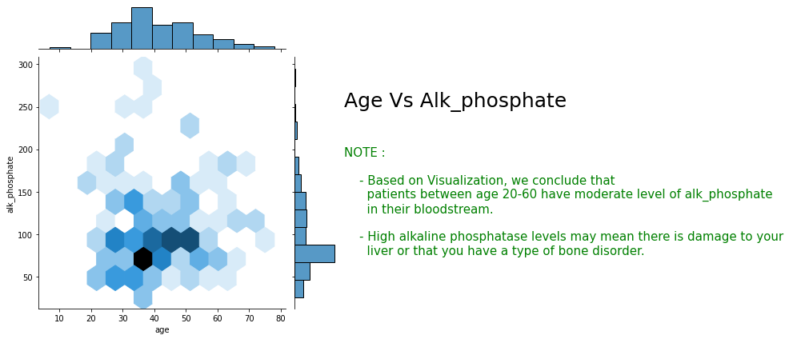
    


### SGOT
 - SGOT are the enzymes produced by the liver.
 - The SGOT test is a blood test that's part of a liver profile. It measures one of two liver enzymes, called serum glutamic-oxaloacetic transaminase. This enzyme is now usually called AST, which stands for aspartate aminotransferase. An SGOT test (or AST test) evaluates how much of the liver enzyme is in the blood.
 - The normal range of an SGOT test is generally between 8 and 45 units per liter of serum. In general, men may naturally have higher amounts of AST in the blood. A score above 50 for men and 45 for women is high and may indicate damage.


```python
dict(df['sgot'].agg(['mean','median','std','var','kurt']))
```


    {'mean': 86.27741935483871,
     'median': 58.0,
     'std': 89.91760553698491,
     'var': 8085.17578550482,
     'kurt': 13.425626026819968}


```python
sns.displot(df['sgot'],kde=True);
statistic,pvalue = shapiro(df['sgot'])
temp = f'''Statistical Normality Test for SGOT\n
H0 : sgot follows normal distribution
H1 : sgot is not normally distributed\n
pvalue    : {round(pvalue,4)} < 0.05\n
Conclusion :\n      Rejecting Null Hypothesis as pvalue 
      is less than 0.05 at 5% level of Significance.
      Thus, Alk_phosphate is not normally distributed.'''
plt.text(750,10,temp,fontsize=20,color='green');
plt.title('Distribution of sgot\n',fontsize=25);
```


    
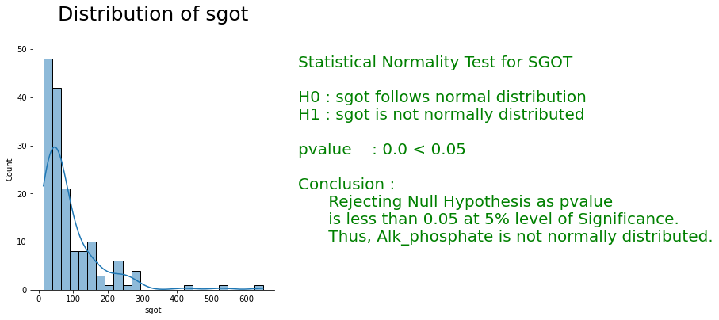
    


```python
sns.jointplot(x="age", y="sgot", data=df,kind='hex');
temp = '''
NOTE : 

    - Based on Visualization, we conclude that
      patients between age 20-60 have moderate level of alk_phosphate
      in their bloodstream.
    
    - If the results of your SGOT test are high, that means one of the
      organs or muscles containing the enzyme could be damaged.
      These include your liver, but also the muscles,heart,brain, and kidneys.
'''
plt.text(100,125,temp,fontsize=15,color='green');
plt.text(100,600,'Age Vs SGOT',fontsize=25);
plt.tight_layout();
```


    
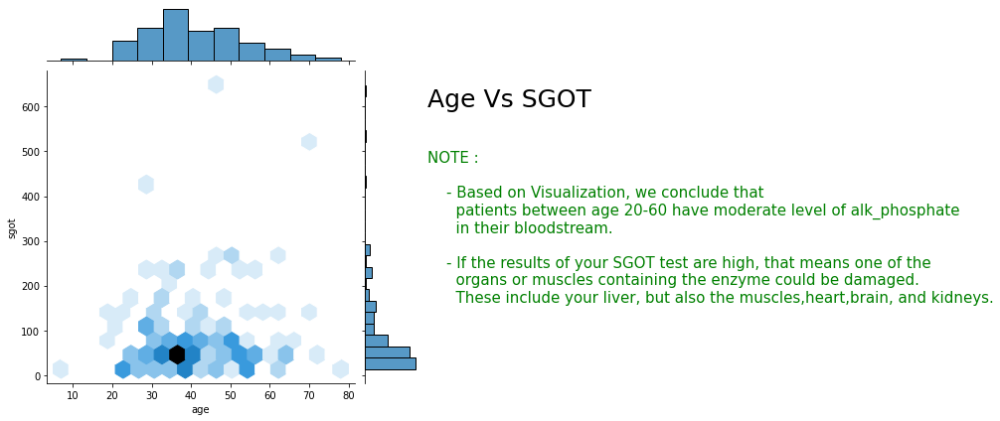
    


Univariate analysis for age, bilirubin, alk_phosphate, sgot, albumin, protime along with individual class


```python
num = df.loc[:,['age','bilirubin','alk_phosphate','sgot','albumin','protime']]

fig,ax = plt.subplots(2,3,figsize=[15,10])
sns.boxplot(data = num,y = 'age',x=df['class'],ax=ax[0,0],linewidth=2.5,palette="Set1")
sns.boxplot(data = num,y = 'bilirubin',x=df['class'],ax=ax[0,1],linewidth=2.5)
sns.boxplot(data = num,y = 'alk_phosphate',x=df['class'],ax=ax[0,2],linewidth=2.5,palette="Set2")
sns.boxplot(data = num,y = 'sgot',x=df['class'],ax=ax[1,0,],linewidth=2.5)
sns.boxplot(data = num,y = 'albumin',x=df['class'],ax=ax[1,1],linewidth=2.5,palette="Set3")
sns.boxplot(data = num,y = 'protime',x=df['class'],ax=ax[1,2],linewidth=2.5)
plt.suptitle('Univariate analysis \n\n(Age, Bilirubin, Alk_phosphate, Sgot, Albumin, Protime) Vs. Class',fontsize=25);
plt.tight_layout();
```


    
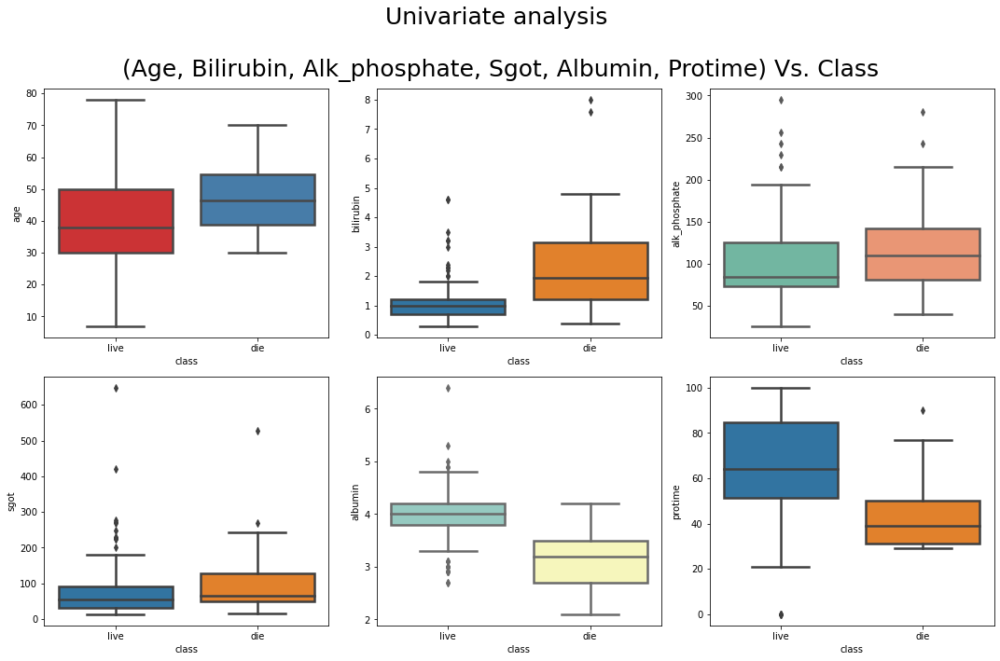
    


## Correlation Matrix for Categorical Data ( Spearman )
 - Higher value of spearman rank correlation coefficient indicate high degree of dependency.


```python
fig = plt.figure(figsize=[15,10])
sns.heatmap(data = df.loc[:,['steroid','antivirals','fatigue','malaise','anorexia','liver_big',
                             'liver_firm','spleen_palpable',
         'spiders','ascites','varices','histology','class']].corr(method='spearman'),annot=True);
plt.suptitle('Spearman Rank Correlation Matrix',fontsize=25);
plt.tight_layout();
```


    
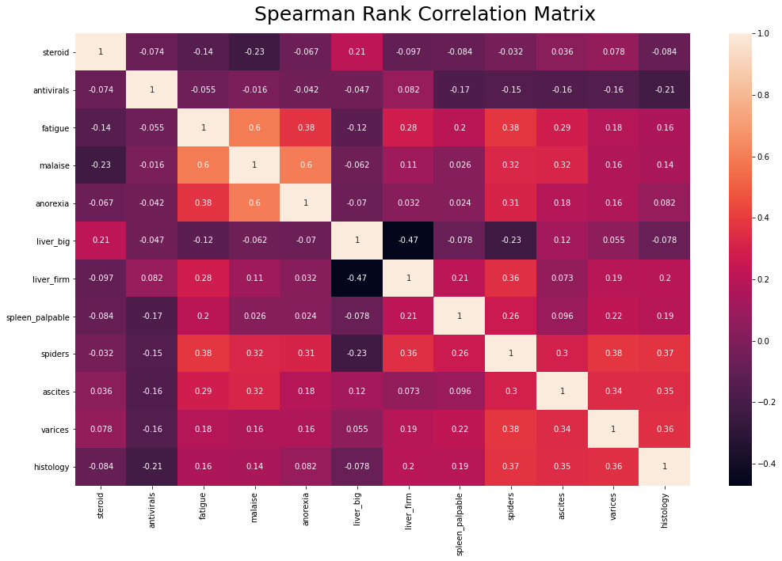
    


## Graphical Representation of Variance - Covarience Matrix


```python
sns.pairplot(numerical_data,corner=True,kind='kde');
plt.suptitle('Bivariate Analysis of Numerical Data',fontsize=25);
plt.tight_layout();
```


    
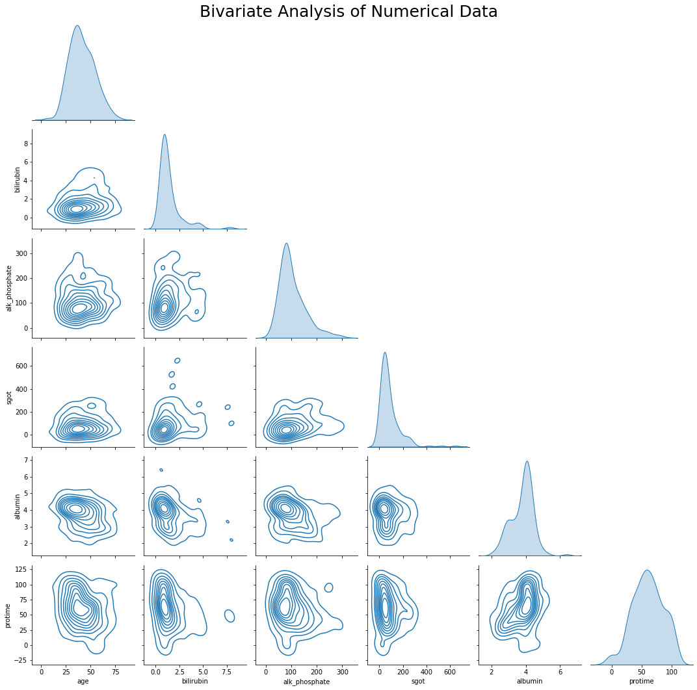
    


## Correlation Matrix for Numerical Data ( Pearson )


```python
fig = plt.figure(figsize=[15,10])
sns.heatmap(data = df.loc[:,['bilirubin','alk_phosphate','sgot','albumin','protime']].corr(),annot=True);
plt.suptitle('Karl Pearson Correlation Matrix',fontsize=25);
plt.tight_layout();
```


    
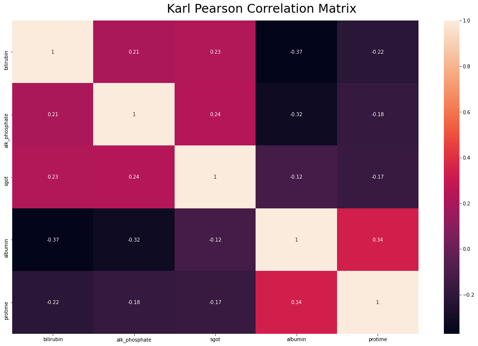
    


Testing Significance of Correlation using Pearsonr


```python
for i in numerical_data.columns:
    print(f'Correlation for {i}',end='\n************************************\n')
    
    for j in numerical_data.columns:
        if i != j:
            p = pearsonr(numerical_data[i],numerical_data[j])
            if p[1]>= 0.05:
                print(j,"corr : ",p[0],"\nprob : ",p[1],'\nResult : insignificant\n--------------------------------------')
            else:
                print(j,"corr : ",p[0],"\nprob : ",p[1],'\nResult : significant\n--------------------------------------')
    print("\n")
```

    Correlation for age
    ************************************
    bilirubin corr :  0.12544713878571642 
    prob :  0.1198716107511516 
    Result : insignificant
    --------------------------------------
    alk_phosphate corr :  -0.012724665855427728 
    prob :  0.8751307160805748 
    Result : insignificant
    --------------------------------------
    sgot corr :  0.10724718870713441 
    prob :  0.18409785118515992 
    Result : insignificant
    --------------------------------------
    albumin corr :  -0.3186651514534744 
    prob :  5.320128210786941e-05 
    Result : significant
    --------------------------------------
    protime corr :  -0.20355072261375612 
    prob :  0.011074925283200155 
    Result : significant
    --------------------------------------
    
    
    Correlation for bilirubin
    ************************************
    age corr :  0.12544713878571642 
    prob :  0.1198716107511516 
    Result : insignificant
    --------------------------------------
    alk_phosphate corr :  0.20916993327302635 
    prob :  0.009000777520721736 
    Result : significant
    --------------------------------------
    sgot corr :  0.23061058283741825 
    prob :  0.0038911465328057074 
    Result : significant
    --------------------------------------
    albumin corr :  -0.3709669782970486 
    prob :  2.0162940069571563e-06 
    Result : significant
    --------------------------------------
    protime corr :  -0.216803312582242 
    prob :  0.006735692275129744 
    Result : significant
    --------------------------------------
    
    
    Correlation for alk_phosphate
    ************************************
    age corr :  -0.012724665855427728 
    prob :  0.8751307160805748 
    Result : insignificant
    --------------------------------------
    bilirubin corr :  0.20916993327302635 
    prob :  0.009000777520721736 
    Result : significant
    --------------------------------------
    sgot corr :  0.24012097663343612 
    prob :  0.002617298431768534 
    Result : significant
    --------------------------------------
    albumin corr :  -0.3197283238744141 
    prob :  5.006265370204863e-05 
    Result : significant
    --------------------------------------
    protime corr :  -0.17810209752590261 
    prob :  0.026612020647023466 
    Result : significant
    --------------------------------------
    
    
    Correlation for sgot
    ************************************
    age corr :  0.10724718870713441 
    prob :  0.18409785118515992 
    Result : insignificant
    --------------------------------------
    bilirubin corr :  0.23061058283741825 
    prob :  0.0038911465328057074 
    Result : significant
    --------------------------------------
    alk_phosphate corr :  0.24012097663343612 
    prob :  0.002617298431768534 
    Result : significant
    --------------------------------------
    albumin corr :  -0.12293387080299585 
    prob :  0.12753075547325474 
    Result : insignificant
    --------------------------------------
    protime corr :  -0.16529578175384993 
    prob :  0.03983855318177244 
    Result : significant
    --------------------------------------
    
    
    Correlation for albumin
    ************************************
    age corr :  -0.3186651514534744 
    prob :  5.320128210786941e-05 
    Result : significant
    --------------------------------------
    bilirubin corr :  -0.3709669782970486 
    prob :  2.0162940069571563e-06 
    Result : significant
    --------------------------------------
    alk_phosphate corr :  -0.3197283238744141 
    prob :  5.006265370204863e-05 
    Result : significant
    --------------------------------------
    sgot corr :  -0.12293387080299585 
    prob :  0.12753075547325474 
    Result : insignificant
    --------------------------------------
    protime corr :  0.33940637837759546 
    prob :  1.558014468361662e-05 
    Result : significant
    --------------------------------------
    
    
    Correlation for protime
    ************************************
    age corr :  -0.20355072261375612 
    prob :  0.011074925283200155 
    Result : significant
    --------------------------------------
    bilirubin corr :  -0.216803312582242 
    prob :  0.006735692275129744 
    Result : significant
    --------------------------------------
    alk_phosphate corr :  -0.17810209752590261 
    prob :  0.026612020647023466 
    Result : significant
    --------------------------------------
    sgot corr :  -0.16529578175384993 
    prob :  0.03983855318177244 
    Result : significant
    --------------------------------------
    albumin corr :  0.33940637837759546 
    prob :  1.558014468361662e-05 
    Result : significant
    --------------------------------------
    
    
    
